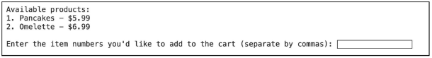
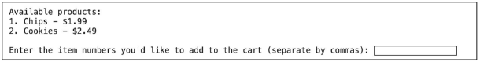
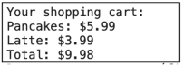
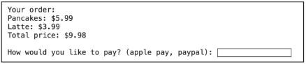

**Coffee corners optimization at IE University!**

**TABLE OF CONTENTS:**
1. [Project Description](#project-description)
2. [Key Features](#key-features)
3. [Technologies Used](#technologies-used)
4. [How It Works](#how-it-works)
5. [Challenges and Learnings](#challenges-and-learnings)
    1. [Challenges](#challenges)
    2. [Future Enhancements](#future-enhancements)
    3. [Why This Solution?](#why-this-solution)
6. [Installation](#installation)
    1. [Windows](#windows)
    2. [macOS](#macos)
    3. [Linux (Ubuntu/Debian)](#linux-ubuntudebian)
7. [Usage](#usage)
8. [Credits](#credits)

---

**Project Description**

The challenge of buying coffee and snacks during the little 10-minute breaks between courses is a problem that many IE University students have, and the Uni Coffee Order App was created to solve this problem. During these brief periods, long lineups and time limits cause delays, discontent, and lost chances to refuel.

A smartphone app that lets students order food and drinks in advance is our approach. The software guarantees that students can enjoy their break without the burden of standing in queue by offering a quick and easy-to-use interface.

*Key Features*

- **Pre-Order System:** Using the app, students can place orders for food and beverages ahead of time.
- **Flexible Payment Options:** Accepts cash on pickup, PayPal, Apple Pay, and other payment options.
- **Optimal Pickup places:** Orders can be picked up from the IE Tower's floors 4, 10, or 21 at convenient places.
- For the best service flow and freshness, real-time order management makes sure that orders are completed within a 30-minute window.
- **User-Friendly Interface:** Made with simplicity in mind, this app enables students to swiftly place orders and navigate it even with hectic schedules.

*Technologies Used*

- **Python**: Core programming language for backend logic.
- **Dictionary Structures**: Efficiently manages products, shopping carts, and past orders.
- **Datetime Module**: Handles timestamps for orders and past orders.
- **Input/Output Handling**: Implements interactive features for user login, browsing, and checkout.
- **Future Enhancements**: Potential integration with a database and a front-end interface for real-world deployment.

*How It Works*

1. **Login and Sign-Up**:
   1. Users log in using their university email.
   1. New users can sign up, and their emails are added to the system.
1. **Main Menu Options**:
   1. Browse available products by category (breakfast, lunch, coffee, snacks).
   1. View and manage items in the shopping cart.
   1. Review past orders with details of prices and dates.
   1. Proceed to checkout for payment and scheduling a pickup time.
1. **Checkout**:
- Users confirm their orders and select a preferred payment method.
- Orders are added to the past orders dictionary upon successful payment.
- The app asks for a pickup time to ensure convenience.

**Challenges and Learnings**

*Challenges*

- Managing product categories and dynamically adding selected items to the cart.
- Handling user input validation to ensure a seamless experience.
- Simulating a real-world ordering system with Python dictionaries and logic.

*Future Enhancements*

- Develop a front-end interface for better usability (e.g., React or Flutter).
- Integrate with a database to persist user data and past orders.
- Add order notifications and tracking features.
- Implement a recommendation system for frequently ordered items.

*Why This Solution?*

This app was created to optimise the brief and precious time students have between classes. By enabling pre-orders and offering a streamlined pickup process, the Uni Coffee Order Project enhances the overall university experience. It also serves as a practical use case for applying Python programming skills to solve real-world problems.

**Installation Windows:**

1. Download Python:
   1. Go to the official website: <https://www.python.org/downloads/>
   1. Click on "Download Python 3.x.x" (latest version)
1. Install Python:
   1. Run the downloaded file (example: python-3.x.x-amd64.exe)
   1. **IMPORTANT: Check the "Add Python to PATH" box before installing**
   1. Click "Install Now"
1. Verify Installation:
- Open Command Prompt (cmd)
- Type: python --version
- You should see the installed version

**macOS:**

1. Method 1 - From website:
   1. Go to <https://www.python.org/downloads/>
   1. Download the macOS version
   1. Run the downloaded .pkg file
   1. Follow the installer instructions
1. Method 2 - Using Homebrew (recommended):
- Open Terminal
  1. Install Homebrew if you don't have it: /bin/bash -c "$(curl -fsSL <https://raw.githubusercontent.com/Homebrew/install/HEAD/install.sh>)"
  1. Install Python: brew install python
3. Verify Installation
   1. Open Terminal
   1. Type: python3 --version

**Linux (Ubuntu/Debian):**

Python usually comes pre-installed, but to make sure: sudo apt update

1. sudo apt install python3
1. Verify Installation: python3 --version

For ALL operating systems - Final Verification:

1. Open terminal/command prompt/powershell
1. Type python (or python3 on Mac/Linux)
1. You should see something like: Python 3.x.x …

\>>>

4. To exit the Python interpreter, type exit()

To run the program:

1. Save the code in a file with .py extension (example: shop.py)
1. Open terminal/command prompt
1. Navigate to the folder where you saved the file: cd path/to/your/folder
1. Run the program: python shop.py *# On Windows* python3 shop.py *# On Mac/Linux*

Common Troubleshooting:

1. If "python" is not recognized in Windows:
   1. Reinstall Python checking "Add Python to PATH"
   1. Or manually add it to system PATH
1. On Mac/Linux if "python" doesn't work:
   1. Use python3 instead
1. If you see module errors:
   1. You shouldn't see any as the program only uses standard module
   1. If they occur, verify that Python was installed correctly
1. If the program doesn't run:
- Verify you're in the correct directory
- Verify the file has the .py extension
- Verify there are no syntax errors in the code

**Usage**

1. **Login or Sign In**

   

. At the start, you will be asked whether you are a buyer (**buyer**) or a worker (**worker**).

1. If you are a **buyer**:

a.1. You will be asked whether you want to **log in** or **sign up**.

a.1.1.1.. If you select **login**: Enter your email and password. If they are correct, you will be logged in to the store.

a.1.1.2. It will then ask you to enter your password.

a.1.2.1. If you select **signup**: Enter a new email and password to create an account.

a.1.2.2. It will then ask you to create your password.

2. If you are a **worker**:

   b.1. You will be asked to enter your worker email and password. If they are correct, you will be logged in to the worker dashboard.

   

   b.2. It will then ask you to enter your password.

2. **Main Menu**

   

Once logged in as a buyer, you will have access to the main menu with the following options:

- **filters**: Filter products by category.
- **shopping cart**: View the products in your cart.
- **past orders**: View your past orders.
- **checkou**t: Proceed to pay for the products in your cart.

3. **Filters**

You can choose from available categories:

- **breakfast**
- **lunch**
- **coffee**
- **Snacks**

1. If you choose **breakfast**. You will be asked to enter the numbers of the products you want to add to your cart, separated by commas.

   

2. If you choose **lunch**. You will be asked to enter the numbers of the products you want to add to your cart, separated by commas.

   

3. If you choose **coffee**. You will be asked to enter the numbers of the products you want to add to your cart, separated by commas.

   

4. If you choose **snacks**. You will be asked to enter the numbers of the products you want to add to your cart, separated by commas.

   

4. **View Shopping Cart**
1. If you haven’t added anything, it will tell you that your cart is empty.

   

2. You can view the items in your cart and the total price.

   

5. **View Shopping Cart**
1. You can view past orders, if you have an account registered. **Necesitamos que alguien con usuario le haga captura a esto.**
1. If any.

   

6. **Checkout**
1. If you have products in your cart, you can proceed with checkout. a.1. Choose a payment method: Apple Pay or PayPal.

   

a.2. Then, it will ask for the time you want to pick up your order.

a.3. The order will be placed, and the cart will be cleared after checkout.

2. If any.

   And you will be resend to the Main Menu.

   

7. **Worker Dashboard**
1. If you log in as a worker, you can access the admin dashboard where you can see the orders placed by buyers.

   **Necesitamos que alguien con usuario le haga captura a esto.**

2. You can choose to either view the orders or exit the dashboard.

   **Necesitamos que alguien con usuario le haga captura a esto.**

   **Notes:**

If you select an invalid option at any time, the program will ask you to try again.

**Credits**

This project was brought to life by the dedication and collaboration of Team 6 members, who worked together to design and implement an innovative solution to improve the everyday experience of IE University students.

- Austin, Levi Singer
- Juzgado García-Aranda, Juan
- Liu, Any Wan Ying
- Montes, Pelayo Zalba
- Terry Sanz Pastor, Pedro
- Drake Saldaña, Miguel

Special thanks to Professor Antonio López Rosell for his guidance and mentorship throughout this project.

Program: Bachelor in Business Administration & Data and Business Analytics (BBA-DBA), *Algorithms and Data Structures* Course

Institution: IE University, Madrid, Spain

This project represents a culmination of teamwork, critical thinking, and programming skills to address real-world challenges faced by students. Thank you for supporting and engaging with our work!
